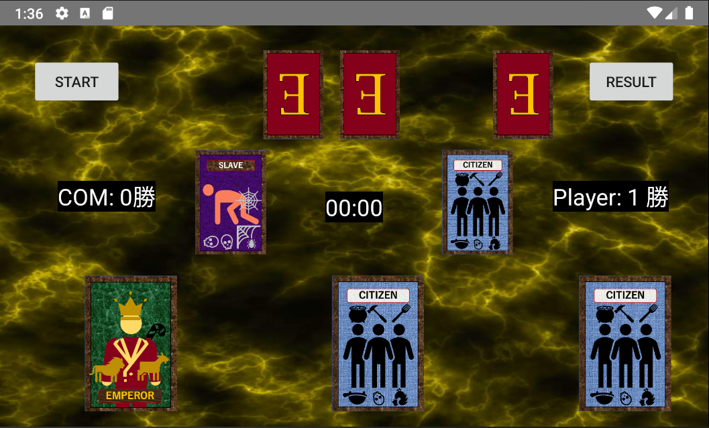

# Kotlin-Kaiji-Ecard

このリポジトリは、私がAndroid studioを使ってKotlinで開発したポートフォリオ用のスマートフォンアプリです。 
背景画像はフリーサイトのものを使い、カードのイラストはMicrosoft Powerpointのアイコンを元に自作しました。 
**背景画像のDL先のリンクを以下に記します。**
- texture.jpg
  - https://ja.pngtree.com/freebackground/black-yellow-shiny-marble-texture-image-background_989031.html

## 動作環境(Virtual Device)
 - Nexus 5X API 28
 - Android 9.0

## Eカードのルール
 詳しいルールは[wikipedia](https://ja.wikipedia.org/wiki/賭博黙示録カイジ#Eカード)に記載のとおりです。
 簡単に説明すると、
  - 賭博黙示録カイジに登場する2人対戦用カードゲーム
  - 皇帝・市民・奴隷の3つのカードを使う、言わば亜種じゃんけん
    - 「皇帝」は「市民」に勝ち、「市民」は「奴隷」に勝ち、「奴隷」は「皇帝」に勝つ
    
  - プレイヤーは皇帝側(皇帝1枚・市民4枚)と奴隷側(奴隷1枚・市民4枚)に分かれ、1枚ずつカードを出し合う
    - 皇帝側は皇帝を通せば勝ち、奴隷側は奴隷を皇帝に当てないと負け。つまり奴隷側が圧倒的に不利
    - 1,3枚目は皇帝側が先にカードを出し、2,4枚目は奴隷側が先に出す
  - 勝敗がついた時点で「1ラウンド」が成立。計12ラウンド競う
    - 原作では「賭け金」を設けているが、簡単のため勝敗数を勝利基準とした

## 工夫点
  * プレイヤー側に制限時間(15秒)を設け、過ぎた場合は左側のカードを自動で出すようにした
  * 試合終了後、左上の「START」ボタンでリトライできるようにした
  * ImageButtonでカードを描画し、クリックするとカードを出せるようにした

## 改善点
  * 2人対戦への拡張
  * 賭け金(ポイント)の追加
  * 冗長なコードの排除
  * 画面遷移(タイトル、ラウンド数選択)の追加
